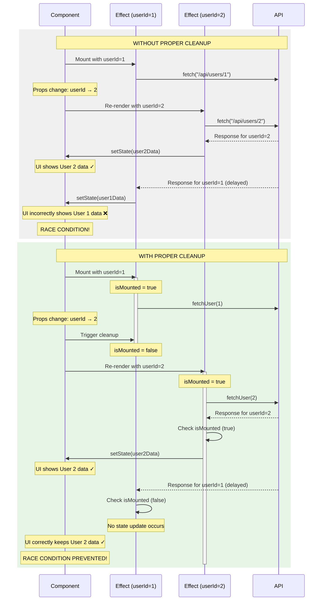
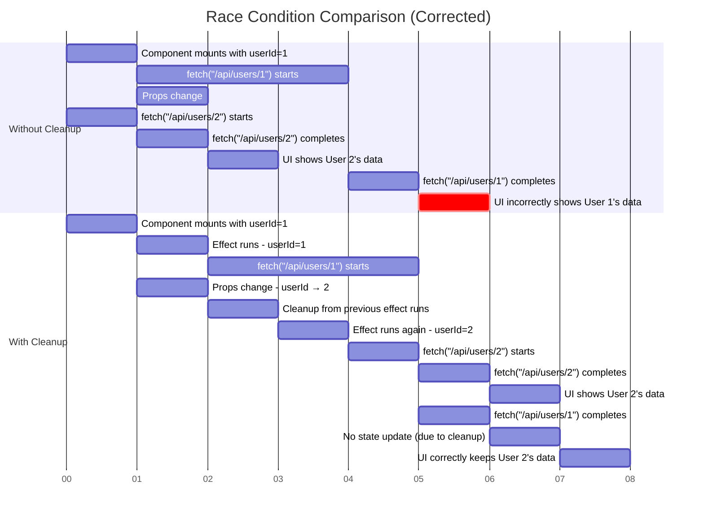

# Race Conditions in React Data Fetching: With vs. Without Proper Cleanup

**NB Docs and the code was genrated by an LLM**

I'll create a textual diagram that illustrates the difference between handling race conditions with and without proper cleanup in a React component. This example will show what happens when a user profile component rapidly switches between different user IDs.

```
WITHOUT PROPER CLEANUP                     | WITH PROPER CLEANUP (useCallback + isMounted flag)
-------------------------------------------|-------------------------------------------
Timeline:                                  | Timeline:
                                           |
t=0: Component mounts with userId=1        | t=0: Component mounts with userId=1
    ↓                                      |     ↓
    useEffect runs                         |     useEffect runs
    ↓                                      |     ↓
    fetch("/api/users/1") starts           |     isMounted = true
    ↓                                      |     ↓
                                           |     fetchUser(1) starts
                                           |
t=1: Props change: userId → 2              | t=1: Props change: userId → 2
    ↓                                      |     ↓
    Component re-renders                   |     Component re-renders
    ↓                                      |     ↓
    useEffect runs again                   |     Cleanup function from previous effect runs
    ↓                                      |     ↓
    fetch("/api/users/2") starts           |     isMounted flag from first effect = false
    ↓                                      |     ↓
                                           |     New useEffect runs
                                           |     ↓
                                           |     New isMounted = true
                                           |     ↓
                                           |     fetchUser(2) starts
                                           |
t=2: fetch("/api/users/2") completes       | t=2: fetchUser(2) completes
    ↓                                      |     ↓
    setState(user2Data)                    |     Check if isMounted === true ✓
    ↓                                      |     ↓
    UI shows User 2's data                 |     setState(user2Data)
    ↓                                      |     ↓
                                           |     UI shows User 2's data
                                           |
t=3: fetch("/api/users/1") completes       | t=3: fetchUser(1) completes
    (slower network or larger payload)     |     (slower network or larger payload)
    ↓                                      |     ↓
    setState(user1Data)                    |     Check if isMounted === true ✗
    ↓                                      |     ↓
    UI incorrectly shows User 1's data     |     No state update occurs
    despite userId being 2                 |     ↓
    ↓                                      |     UI correctly continues showing User 2's data
    RACE CONDITION! ❌                     |     RACE CONDITION PREVENTED! ✓
                                           |
RESULT: Stale data from User 1 overwrites  | RESULT: Only data from the most recent request
the more recent User 2 data                | is used to update the component state
```

### Visual Explanation of the Race Condition Problem

```
WITHOUT CLEANUP:
--------------
userId=1 → fetch(1) starts ----long request---→ setState(user1) ⚠️ STALE DATA DISPLAYED
                 ↓
userId=2 → fetch(2) starts →→→ setState(user2) → CORRECT DATA
                                    ↑
                                OVERWRITTEN

WITH CLEANUP:
--------------
userId=1 → fetch(1) starts ----long request---→ isMounted? NO → No state update ✓
                 ↓            ↑
                 ↓            | (cleanup sets isMounted=false)
                 ↓            ↓
userId=2 → fetch(2) starts →→→ setState(user2) → CORRECT DATA PRESERVED
```

### Code Comparison

```jsx
// WITHOUT PROPER CLEANUP
useEffect(() => {
  fetch(`/api/users/${userId}`)
    .then(res => res.json())
    .then(data => {
      // This will run even if userId has changed!
      setData(data);
      setIsLoading(false);
    });
}, [userId]);

// WITH PROPER CLEANUP
const fetchUser = useCallback(() => {
  return fetch(`/api/users/${userId}`).then(res => res.json());
}, [userId]);

useEffect(() => {
  let isMounted = true;

  fetchUser().then(data => {
    // Only update state if this is still the current effect
    if (isMounted) {
      setData(data);
      setIsLoading(false);
    }
  });

  // Cleanup function runs before next effect or unmount
  return () => {
    isMounted = false;
  };
}, [fetchUser]);
```

This diagram illustrates why proper cleanup is essential for preventing race conditions in React components that fetch data. Without cleanup, you risk displaying stale or incorrect data when requests complete out of order. With proper cleanup using the isMounted flag pattern, you ensure that only the most recent request's data is used to update the component state.

## Prompt:

create an svg or a mermaid for the diagrams

## LLM:

I'll create a Mermaid diagram to visualize the race condition scenarios with and without proper cleanup.



Here's an alternative visualization using a timeline format:



These diagrams illustrate how the race condition occurs without proper cleanup and how the isMounted flag pattern prevents it by ensuring that only the most recent request's data is used to update the component state.

## Prompt:

Could you write the code to simulate the two scenarios?

## LLM:

# Race Condition Simulation in React

Here's a complete code example that simulates both scenarios: one with a race condition due to lack of proper cleanup, and one that prevents race conditions using the useCallback + isMounted pattern.

## Complete React Component

```jsx
import React, { useState, useEffect, useCallback } from 'react';

// Simulated API with variable delay to demonstrate race conditions
const fetchUserData = (userId) => {
  console.log(`Fetching user ${userId}...`);
  // Simulate network delay - user 1 takes longer than user 2
  const delay = userId === 1 ? 3000 : 1000;

  return new Promise((resolve) => {
    setTimeout(() => {
      console.log(`Received data for user ${userId}`);
      resolve({
        id: userId,
        name: `User ${userId}`,
        email: `user${userId}@example.com`
      });
    }, delay);
  });
};

// Component demonstrating both approaches
function RaceConditionDemo() {
  const [userId, setUserId] = useState(1);

  // Toggle between users to trigger race condition
  const toggleUser = () => {
    setUserId(prevId => prevId === 1 ? 2 : 1);
  };

  return (
    <div className="race-condition-demo">
      <h2>Race Condition Demonstration</h2>
      <div className="user-controls">
        <p>Current User ID: {userId}</p>
        <button onClick={toggleUser}>Toggle User</button>
        <p>
          <small>
            Click "Toggle User" quickly to simulate race condition.
            Check console for request/response logs.
          </small>
        </p>
      </div>

      <div className="demo-containers">
        <WithoutCleanup userId={userId} />
        <WithCleanup userId={userId} />
      </div>
    </div>
  );
}

// Component WITHOUT proper cleanup - will have race conditions
function WithoutCleanup({ userId }) {
  const [data, setData] = useState(null);
  const [loading, setLoading] = useState(true);

  useEffect(() => {
    console.log(`[WITHOUT CLEANUP] Effect running for userId=${userId}`);
    setLoading(true);

    fetchUserData(userId)
      .then(userData => {
        console.log(`[WITHOUT CLEANUP] Setting state for userId=${userId}`);
        setData(userData);
        setLoading(false);
      });

    // No cleanup function!
  }, [userId]);

  return (
    <div className="demo-panel">
      <h3>Without Cleanup (Race Condition Possible)</h3>
      {loading ? (
        <p>Loading...</p>
      ) : (
        <div className="user-data">
          <p><strong>ID:</strong> {data.id}</p>
          <p><strong>Name:</strong> {data.name}</p>
          <p><strong>Email:</strong> {data.email}</p>
          <p className="timestamp">Last updated: {new Date().toLocaleTimeString()}</p>
        </div>
      )}
    </div>
  );
}

// Component WITH proper cleanup - prevents race conditions
function WithCleanup({ userId }) {
  const [data, setData] = useState(null);
  const [loading, setLoading] = useState(true);

  // Memoize the fetch function with useCallback
  const fetchUser = useCallback(() => {
    console.log(`[WITH CLEANUP] fetchUser called for userId=${userId}`);
    return fetchUserData(userId);
  }, [userId]);

  useEffect(() => {
    console.log(`[WITH CLEANUP] Effect running for userId=${userId}`);
    setLoading(true);

    // Track if component is still mounted for this effect instance
    let isMounted = true;

    fetchUser()
      .then(userData => {
        if (isMounted) {
          console.log(`[WITH CLEANUP] Setting state for userId=${userId} (isMounted=${isMounted})`);
          setData(userData);
          setLoading(false);
        } else {
          console.log(`[WITH CLEANUP] Ignoring response for userId=${userId} (isMounted=${isMounted})`);
        }
      });

    // Cleanup function that runs when effect is re-executed or component unmounts
    return () => {
      console.log(`[WITH CLEANUP] Cleanup for userId=${userId}`);
      isMounted = false;
    };
  }, [fetchUser]);

  return (
    <div className="demo-panel">
      <h3>With Cleanup (Race Condition Prevented)</h3>
      {loading ? (
        <p>Loading...</p>
      ) : (
        <div className="user-data">
          <p><strong>ID:</strong> {data.id}</p>
          <p><strong>Name:</strong> {data.name}</p>
          <p><strong>Email:</strong> {data.email}</p>
          <p className="timestamp">Last updated: {new Date().toLocaleTimeString()}</p>
        </div>
      )}
    </div>
  );
}

export default RaceConditionDemo;
```

## CSS for the Demo

```css
.race-condition-demo {
  font-family: system-ui, -apple-system, sans-serif;
  max-width: 800px;
  margin: 0 auto;
  padding: 20px;
}

.user-controls {
  margin-bottom: 20px;
  padding: 15px;
  background-color: #f5f5f5;
  border-radius: 5px;
}

.demo-containers {
  display: flex;
  gap: 20px;
}

.demo-panel {
  flex: 1;
  padding: 15px;
  border: 1px solid #ddd;
  border-radius: 5px;
  box-shadow: 0 2px 4px rgba(0, 0, 0, 0.1);
}

.demo-panel h3 {
  margin-top: 0;
  padding-bottom: 10px;
  border-bottom: 1px solid #eee;
}

.user-data {
  background-color: #f9f9f9;
  padding: 10px;
  border-radius: 4px;
}

.timestamp {
  font-size: 0.8em;
  color: #666;
  margin-top: 15px;
}

button {
  background-color: #4a90e2;
  color: white;
  border: none;
  padding: 8px 16px;
  border-radius: 4px;
  cursor: pointer;
  font-size: 14px;
}

button:hover {
  background-color: #3a80d2;
}
```

## How to Use This Demo

2. Render the `RaceConditionDemo` component in your React application
3. Open your browser's console to see the detailed logs
4. Click the "Toggle User" button once and wait for both panels to load
5. Click the "Toggle User" button again quickly (before the first request completes)
6. Observe the difference in behavior:
   - The "Without Cleanup" panel will show incorrect data if User 1's request (which is slower) completes after User 2's
   - The "With Cleanup" panel will always show the correct data for the current userId

## Expected Console Output When Race Condition Occurs

```
[WITHOUT CLEANUP] Effect running for userId=1
[WITH CLEANUP] Effect running for userId=1
[WITHOUT CLEANUP] Fetching user 1...
[WITH CLEANUP] fetchUser called for userId=1
[WITH CLEANUP] Fetching user 1...

// User toggled to 2
[WITHOUT CLEANUP] Effect running for userId=2
[WITH CLEANUP] Cleanup for userId=1
[WITH CLEANUP] Effect running for userId=2
[WITHOUT CLEANUP] Fetching user 2...
[WITH CLEANUP] fetchUser called for userId=2
[WITH CLEANUP] Fetching user 2...

// User 2 data arrives first (faster response)
[WITHOUT CLEANUP] Received data for user 2
[WITH CLEANUP] Received data for user 2
[WITHOUT CLEANUP] Setting state for userId=2
[WITH CLEANUP] Setting state for userId=2 (isMounted=true)

// User 1 data arrives later (slower response)
[WITHOUT CLEANUP] Received data for user 1
[WITH CLEANUP] Received data for user 1
[WITHOUT CLEANUP] Setting state for userId=1  // PROBLEM: This overwrites User 2 data!
[WITH CLEANUP] Ignoring response for userId=1 (isMounted=false)  // CORRECT: Ignores stale data
```

This demo clearly illustrates how race conditions can occur in React components that fetch data, and how proper cleanup using the isMounted flag pattern can prevent these issues. The "Without Cleanup" component will sometimes display incorrect data when requests complete out of order, while the "With Cleanup" component will always display the correct data for the current userId.
